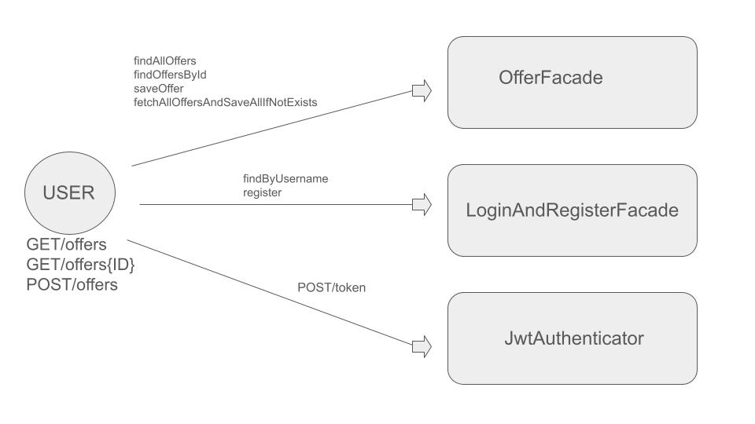

# JobOffers overview
- A web application collecting the latest job offers for Junior Java Developers

# Technologies:
- CORE: Java 17, Apache Maven, Spring boot, MongoDB, Docker, Redis

- TESTING: JUnit5, Mockito, Testcontainers 

# Architecture:

# Use cases of this API:

1. We use a remote HTTP server (a script that downloads offers from websites)
2. The customer must use the token to see the offers
3. Customer can register
4. Offers in the database are updated every 3 hours (then we query the remote server from point 1)
5. Offers in the database cannot be repeated (the offer URL decides)
6. The client can download one job offer via a unique ID
7. Customer can download all available offers when authorized
8. If the client makes more than one query within 60 minutes, the data should be downloaded from the cache
   (because downloading from the database costs our client money)
9. The customer can manually add a job offer
10. Each job offer has (link to the offer, position name, company name, salary)

